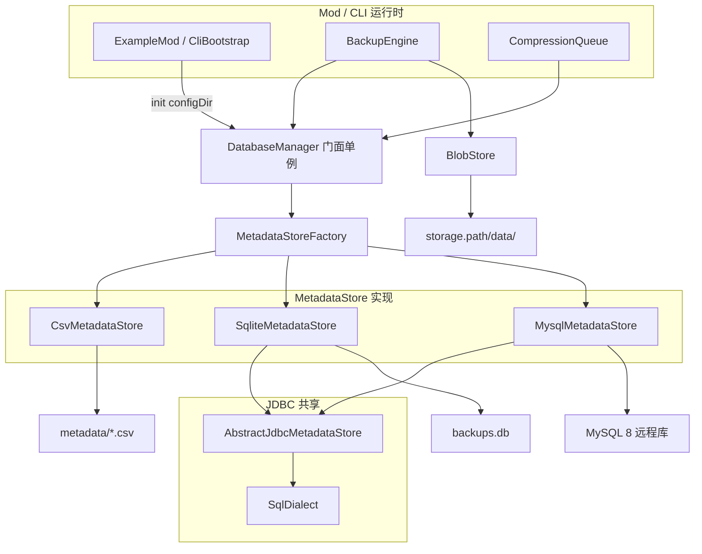

# 元数据存储开发文档

本文档描述 Instant Backup 模组**备份元数据**（版本列表、文件 manifest、blob 状态）的多后端存储设计，供实现者与运维人员参考。

> **实现状态**
>
> | 后端 | 状态 | 说明 |
> |------|------|------|
> | SQLite | ✅ 已实现 | [`SqliteMetadataStore`](../core/src/main/java/io/github/limuqy/mc/backup/database/sqlite/SqliteMetadataStore.java) |
> | CSV | ✅ 已实现 | 默认后端；[`CsvMetadataStore`](../core/src/main/java/io/github/limuqy/mc/backup/database/csv/CsvMetadataStore.java) + [`CsvTableIO`](../core/src/main/java/io/github/limuqy/mc/backup/database/csv/CsvTableIO.java) |
> | MySQL 8 | ✅ 已实现 | [`MysqlMetadataStore`](../core/src/main/java/io/github/limuqy/mc/backup/database/mysql/MysqlMetadataStore.java) |

---

## 1. 概述

### 1.1 元数据与物理数据的分工

| 层级 | 内容 | 存储位置 |
|------|------|----------|
| **元数据** | 备份版本、每版本文件清单、blob 注册表与状态 | 由 `storage.metadata.type` 决定（CSV / SQLite / MySQL） |
| **物理 blob** | ZSTD 压缩后的世界文件块 | 始终在 `<storage.path>/data/`（与元数据后端无关） |

元数据后端只影响「版本与 manifest 记在哪里」；blob 去重文件始终写在本地（或 `storage.path` 指向的目录/NAS）。

### 1.2 三后端对比

| 维度 | CSV（默认） | SQLite | MySQL 8 |
|------|-------------|--------|---------|
| 配置键 | `storage.metadata.type=csv` | `storage.metadata.type=sqlite` | `storage.metadata.type=mysql` |
| 存储位置 | `config/instantbackup/metadata/` | `config/instantbackup/backups.db` | 远程 MySQL 实例 |
| Mod 额外库 | OpenCSV（shade） | 无 JDBC；需 Minecraft SQLite JDBC 模组 | mysql-connector-j（shade） |
| CLI 额外库 | OpenCSV（随 core 传递） | shadowJar 内嵌 xerial JDBC | shadowJar 内嵌 mysql-connector-j |
| 适用场景 | 单服、零依赖、易备份/审计 | 单服、较大 manifest、熟悉嵌入式库 | 多服共库、运维集中管理、大规模查询 |
| 手工可读 | 高（纯文本 CSV） | 低（需 sqlite3 工具） | 低（需 SQL 客户端） |

### 1.3 设计原则

1. **调用方零感知**：[`BackupEngine`](../core/src/main/java/io/github/limuqy/mc/backup/backup/BackupEngine.java)、[`CompressionQueue`](../core/src/main/java/io/github/limuqy/mc/backup/compression/CompressionQueue.java) 等继续通过 [`DatabaseManager`](../core/src/main/java/io/github/limuqy/mc/backup/database/DatabaseManager.java) 单例访问；内部委托给 `MetadataStore` 实现。
2. **逻辑 schema 统一**：三种后端共用 **schema v2** 四表语义（见 §4）。
3. **不做跨后端自动迁移**：切换 `storage.metadata.type` 不会导入旧后端数据；运维需自行规划。
4. **core 不打包 JDBC 驱动**：SQLite / MySQL 驱动由 loader shade 或外部 Mod 提供；CSV 使用 **OpenCSV**（`core` `api` 依赖，loader shade 打入 Mod JAR）。

---

## 2. 架构

### 2.1 组件关系



### 2.2 初始化时序

```
SERVER_STARTING / CLI 启动
  → BackupConfig.init(configDir)          # 读取 instantbackup.properties
  → DatabaseManager.getInstance().init(configDir)
       → MetadataStoreFactory.create(BackupConfig.getMetadataBackend())
       → MetadataStore.init(configDir)    # 建目录 / 连库 / 校验 schema
  → BackupEngine.init(worldPath, backupPath, ...)
       → loadFileCaches()                 # 依赖 MetadataStore 已连接
       → recoverOnStartup()
  → CompressionQueue.start(blobStore)
```

初始化失败时（驱动缺失、MySQL 连不上等），`init` 返回 `false`，备份功能不可用，日志输出中文排查指引。

### 2.3 目标包结构

```
core/src/main/java/io/github/limuqy/mc/backup/database/
├── MetadataStore.java              # 接口
├── MetadataBackend.java            # 枚举 CSV | SQLITE | MYSQL
├── MetadataStoreFactory.java
├── DatabaseManager.java            # 门面（保留现有 public API）
├── VersionInfo.java / FileInfo.java / BlobInfo.java
├── VersionStatus.java / BlobState.java
├── csv/
│   ├── CsvMetadataStore.java
│   └── CsvTableIO.java             # OpenCSV 读写封装
├── jdbc/
│   ├── AbstractJdbcMetadataStore.java
│   └── SqlDialect.java
├── sqlite/
│   └── SqliteMetadataStore.java
└── mysql/
    └── MysqlMetadataStore.java
```

---

## 3. 配置参考

配置 file：`config/instantbackup/instantbackup.properties`

### 3.1 后端选择

```properties
# 元数据存储后端：csv（默认）| sqlite | mysql
storage.metadata.type=csv
```

| 值 | 行为 |
|----|------|
| `csv` | 使用 `config/instantbackup/metadata/` 下 CSV 文件 |
| `sqlite` | 使用 `config/instantbackup/backups.db` |
| `mysql` | 连接远程 MySQL，使用 `storage.mysql.*` |
| 非法值 | 回退 `csv` 并输出 warn 日志 |

**与 `storage.path` 的关系：**

- `storage.path`：blob 物理根目录（默认 `backups`，可绝对路径跨盘）。
- 元数据路径：**不**随 `storage.path` 迁移（CSV / SQLite 固定在 `config/instantbackup/`；MySQL 在远程）。

### 3.2 MySQL 连接项（`type=mysql` 时生效）

```properties
storage.mysql.host=127.0.0.1
storage.mysql.port=3306
storage.mysql.database=instantbackup
storage.mysql.username=backup
storage.mysql.password=
storage.mysql.table_prefix=ib_
storage.mysql.use_ssl=false
storage.mysql.connection_timeout=30
```

| 键 | 默认 | 说明 |
|----|------|------|
| `host` | `127.0.0.1` | 主机名或 IP |
| `port` | `3306` | 端口 |
| `database` | `instantbackup` | 库名（需预先创建） |
| `username` | `backup` | 连接用户 |
| `password` | 空 | 建议非空；CLI 可用环境变量 `INSTANTBACKUP_MYSQL_PASSWORD` 覆盖 |
| `table_prefix` | `ib_` | 表名前缀，便于同库多实例 |
| `use_ssl` | `false` | JDBC `useSSL` |
| `connection_timeout` | `30` | 秒 |

**JDBC URL 模板：**

```
jdbc:mysql://{host}:{port}/{database}?useSSL={use_ssl}&allowPublicKeyRetrieval=true&characterEncoding=utf8mb4&serverTimezone=UTC
```

### 3.3 默认配置生成

[`BackupConfig.generateDefaultConfig()`](../core/src/main/java/io/github/limuqy/mc/backup/config/BackupConfig.java) 需在 `# 存储设置` 段增加上述项，并附中文注释说明各后端差异。

---

## 4. 逻辑 Schema（schema v2）

当前 [`DatabaseManager`](../core/src/main/java/io/github/limuqy/mc/backup/database/DatabaseManager.java) 中 `SCHEMA_VERSION = 2`。三种后端必须保持**相同字段语义**。

### 4.1 表：`schema_meta`

| 列 | 类型 | 说明 |
|----|------|------|
| `version` | INT | 当前 schema 版本，固定写入 `2` |

### 4.2 表：`backup_versions`

| 列 | 类型 | 说明 |
|----|------|------|
| `id` | 自增 PK | 内部版本 ID |
| `version_name` | TEXT/VARCHAR(32) UNIQUE | `yyyyMMdd_HHmmss` |
| `timestamp` | DATETIME | 创建时间 |
| `description` | TEXT | 备注，可为空 |
| `file_count` | INT | manifest 文件数 |
| `total_size` | BIGINT | 逻辑总字节数 |
| `is_manual` | BOOL | 是否手动触发 |
| `status` | INT | `VersionStatus` 码：0=IN_PROGRESS，1=COMPLETED |

### 4.3 表：`blobs`

| 列 | 类型 | 说明 |
|----|------|------|
| `blob_key` | TEXT/VARCHAR(512) PK | 路径 + hash 组合键 |
| `file_path` | TEXT | 相对世界根的路径 |
| `file_hash` | TEXT | XXHash64 十六进制 |
| `file_size` | BIGINT | 原始大小 |
| `is_chunk` | BOOL | 是否区块 `.mca` |
| `state` | INT | `BlobState`：0=PENDING，1=STAGED，2=STORED |
| `compressed_size` | BIGINT | `.zst` 大小，未压缩时为 0 |

### 4.4 表：`file_info`

| 列 | 类型 | 说明 |
|----|------|------|
| `id` | 自增 PK | 行 ID |
| `version_id` | FK → backup_versions.id | 所属版本 |
| `file_path` | TEXT | 相对路径 |
| `file_hash` | TEXT | 与 blob 一致 |
| `file_size` | BIGINT | 文件大小 |
| `is_chunk` | BOOL | 是否区块 |
| `blob_key` | TEXT | 关联 blobs |

**索引（JDBC 后端）：**

- `idx_file_info_version_id` ON `file_info(version_id)`
- `idx_file_info_blob_key` ON `file_info(blob_key)`
- `idx_blobs_state` ON `blobs(state)`

**外键：** `file_info.version_id` → `backup_versions(id) ON DELETE CASCADE`

### 4.5 枚举码表

**`BlobState`**（[`BlobState.java`](../core/src/main/java/io/github/limuqy/mc/backup/database/BlobState.java)）：

| 码 | 枚举 | 含义 |
|----|------|------|
| 0 | PENDING | 元数据已登记，物理内容仍依赖世界或 COW |
| 1 | STAGED | 已复制 raw，等待压缩 |
| 2 | STORED | 已写入 `.zst` |

**`VersionStatus`**（[`VersionStatus.java`](../core/src/main/java/io/github/limuqy/mc/backup/database/VersionStatus.java)）：

| 码 | 枚举 | 含义 |
|----|------|------|
| 0 | IN_PROGRESS | 仍有 blob 非 STORED |
| 1 | COMPLETED | 全部 blob 已 STORED |

---

## 5. MetadataStore 接口规范

门面 [`DatabaseManager`](../core/src/main/java/io/github/limuqy/mc/backup/database/DatabaseManager.java) 保留下列 public 方法，内部转发至 `MetadataStore`：

### 5.1 生命周期

| 方法 | 说明 |
|------|------|
| `boolean init(Path configDir)` | 按 backend 初始化存储 |
| `boolean isConnected()` | 是否可用 |
| `void close()` | 释放连接 / 刷盘 |

### 5.2 版本

| 方法 | 说明 |
|------|------|
| `int insertVersion(VersionInfo)` | 插入并返回 id |
| `void updateVersionStats(int versionId, int fileCount, long totalSize)` | 更新统计 |
| `void updateVersionStatus(int versionId, VersionStatus)` | 更新状态 |
| `VersionInfo getVersion(int id)` | 按 id 查询 |
| `VersionInfo getVersionByName(String versionName)` | 按名称查询 |
| `List<VersionInfo> getAllVersions()` | 按 timestamp DESC |
| `VersionInfo getLatestVersion()` | 最新一条 |
| `void deleteVersion(int id)` | 删除版本行（CASCADE 删 file_info） |
| `boolean isVersionFullyStored(int versionId)` | JOIN blobs 检查是否全 STORED |
| `void refreshVersionCompletion(int versionId)` | 根据 blob 状态更新 COMPLETED/IN_PROGRESS |
| `List<Integer> getVersionIdsUpTo(int versionId)` | 从指定 id 起（含）至最新的 id 列表 |

### 5.3 文件 manifest

| 方法 | 说明 |
|------|------|
| `void insertFiles(List<FileInfo>)` | 批量插入 |
| `List<FileInfo> getFilesByVersionId(int versionId)` | 版本 manifest |
| `void deleteFilesByVersionId(int versionId)` | 删除版本 manifest |
| `List<FileInfo> getFilesByBlobKeys(List<String>)` | 按 blob_key IN 查询（当前仅 DatabaseManager 定义，GC 未直接使用） |

### 5.4 Blob

| 方法 | 说明 |
|------|------|
| `void upsertBlob(BlobInfo)` | 插入或更新 state/compressed_size |
| `BlobInfo getBlob(String blobKey)` | 单条查询 |
| `void updateBlobState(String blobKey, BlobState, long compressedSize)` | 更新状态 |
| `List<BlobInfo> getBlobsByState(BlobState)` | 按状态列表 |
| `int countBlobsByState(BlobState)` | 计数 |
| `List<BlobInfo> getPendingBlobsForVersions(List<Integer> versionIds)` | 指定版本集合内的 PENDING blob |
| `int getBlobReferenceCount(String blobKey)` | file_info 引用数 |
| `void deleteBlob(String blobKey)` | 删除 blob 行 |
| `List<BlobInfo> gcUnreferencedBlobs()` | 删除零引用 blob，返回被删列表供删物理文件 |
| `void clearAllBlobs()` | 清空 blobs 表（clean 命令） |

异常约定：当前实现使用 `throws SQLException`；CSV 实现可将 `IOException` 包装为 `SQLException` 以保持调用方兼容。

---

## 6. CSV 后端（默认）

### 6.1 目录布局

```
config/instantbackup/
├── instantbackup.properties
└── metadata/
    ├── schema.properties       # version=2
    ├── versions.csv
    ├── blobs.csv
    └── file_info.csv
```

### 6.2 OpenCSV 依赖

CSV 读写使用 [OpenCSV](https://opencsv.sourceforge.net/)（`com.opencsv:opencsv:4.6`），由 `core` 模块 `api` 引入，loader / CLI 随 Mod JAR shade 打入。

| 项 | 说明 |
|----|------|
| Maven 坐标 | `com.opencsv:opencsv:4.6` |
| 版本选择 | 4.6 为最后支持 **Java 8** 的版本，兼容 1.16.5 锚点；5.x 需 Java 11+ |
| 传递依赖 | `commons-lang3`、`commons-beanutils`、`commons-collections4`（一并 shade） |
| 封装类 | `CsvTableIO` 统一配置 Reader/Writer，避免业务类散落 OpenCSV API |

**`CsvTableIO` 约定配置：**

```java
// 读：首行表头，UTF-8
CSVReaderBuilder builder = new CSVReaderBuilder(reader)
    .withCSVParser(new CSVParserBuilder()
        .withSeparator(',')
        .withQuoteChar('"')
        .withIgnoreLeadingWhiteSpace(true)
        .build());

// 写：RFC 4180，逐行 flush 前写入 StringWriter / 临时文件
CSVWriter writer = new CSVWriterBuilder(out)
    .withParser(new CSVParserBuilder()
        .withSeparator(',')
        .withQuoteChar('"')
        .build())
    .build();
```

**行 ↔ 实体映射：**

- 简单表（固定列序）：`ColumnPositionMappingStrategy<T>` + `@CsvBindByPosition`
- 或手动：`String[] row → parseRow()`，便于 `id` 自增与 nullable 列控制

**禁止**在 `CsvMetadataStore` 外直接使用 `CSVReader`/`CSVWriter`；所有转义、引号、逗号规则由 OpenCSV 处理，§6.3 语义约束仍然有效。

**`CsvTableIO` 建议 API（实现参考）：**

| 方法 | 说明 |
|------|------|
| `List<String[]> readAll(Path csv, boolean hasHeader)` | 读入全部数据行（跳过表头） |
| `void writeAll(Path csv, String[] header, List<String[]> rows)` | 原子写：先写 `.tmp` 再 `ATOMIC_MOVE` |
| `String[] headerFor(String table)` | 返回 `versions` / `blobs` / `file_info` 固定表头 |

读写时使用 `Files.newBufferedReader/writer(path, UTF_8)`，与 §6.5 原子写盘策略配合。

### 6.3 文件格式

- **编码**：UTF-8（无 BOM）；`InputStreamReader` / `OutputStreamWriter` 显式 `StandardCharsets.UTF_8`
- **分隔符**：逗号 `,`（OpenCSV 默认）
- **换行**：`\n`（写入时统一 LF）
- **引号与转义**：由 OpenCSV 按 RFC 4180 自动处理
- **布尔**：`0` / `1`
- **时间戳**：`yyyy-MM-dd'T'HH:mm:ss`（本地时间，与 `VersionInfo.timestamp` 一致）
- **首行**：必须为表头，列名与 SQL 列名一致

### 6.4 各文件表头与示例

**schema.properties**

```properties
version=2
```

**versions.csv**

```csv
id,version_name,timestamp,description,file_count,total_size,is_manual,status
1,20260628_143025,2026-06-28T14:30:25,开服首日,1523,104857600,1,1
```

**blobs.csv**

```csv
blob_key,file_path,file_hash,file_size,is_chunk,state,compressed_size
world/region/r.0.0.mca#abc123...,world/region/r.0.0.mca,abc123...,1048576,1,2,524288
```

**file_info.csv**

```csv
id,version_id,file_path,file_hash,file_size,is_chunk,blob_key
1,1,world/region/r.0.0.mca,abc123...,1048576,1,world/region/r.0.0.mca#abc123...
```

> `blob_key` 的实际拼接规则以 [`BackupEngine`](../core/src/main/java/io/github/limuqy/mc/backup/backup/BackupEngine.java) 现有逻辑为准；CSV 仅原样存储。

### 6.5 持久化策略

1. **启动**：读取四个文件 → 构建内存索引（`Map<String, BlobInfo>`、`Map<Integer, List<FileInfo>>` 等）。
2. **写入**：`ReentrantReadWriteLock` 保护；更新内存 → 写临时文件 `{name}.tmp` → `Files.move(..., ATOMIC_MOVE)` 替换。
3. **ID 分配**：启动时 `nextVersionId = max(id)+1`，`nextFileInfoId` 同理。
4. **批量**：`insertFiles` 内存追加后，OpenCSV `writeAll` 或追加行后单次 flush `file_info.csv`。

### 6.6 查询实现要点

| SQL 语义 | CSV 实现 |
|----------|----------|
| `isVersionFullyStored` | 遍历 version 的 file_info，查 blobs.state |
| `getPendingBlobsForVersions` | versionIds → file_info.blob_key → blobs WHERE state=PENDING |
| `gcUnreferencedBlobs` | 统计 blob_key 在 file_info 出现次数，零引用则删 blobs 行 |
| `getAllVersions ORDER BY timestamp DESC` | 内存排序 |

### 6.7 限制与运维

- 不适合在备份进行中手工编辑 CSV；可能导致内存与磁盘不一致。
- 超大规模 manifest（百万级行）建议改用 SQLite 或 MySQL。
- 整个 `metadata/` 目录可直接复制做元数据备份（blob 仍需单独备份 `storage.path/data/`）。

---

## 7. SQLite 后端

### 7.1 存储位置

```
config/instantbackup/backups.db
```

不随 `storage.path` 变化。历史版本曾在 `backups/backups.db`，[`BackupEngine.cleanOldDatabaseFiles()`](../core/src/main/java/io/github/limuqy/mc/backup/backup/BackupEngine.java) 会清理旧路径。

### 7.2 驱动与依赖

| 环境 | 驱动来源 |
|------|----------|
| **Mod 生产** | 服主安装 [Minecraft SQLite JDBC](https://modrinth.com/plugin/minecraft-sqlite-jdbc)（Modrinth slug: `minecraft-sqlite-jdbc`） |
| **Mod 开发** | `modCompileOnly "maven.modrinth:minecraft-sqlite-jdbc:3.53.2.0"`（不打包进发布 JAR） |
| **CLI** | shadowJar 内嵌 `org.xerial:sqlite-jdbc:3.53.2.0` |

Mod **不得** shade `org.xerial:sqlite-jdbc`（与 MySQL 策略不同）。

### 7.3 驱动加载

[`DatabaseManager.loadSqliteDriver()`](../core/src/main/java/io/github/limuqy/mc/backup/database/DatabaseManager.java) 逻辑迁移至 `SqliteMetadataStore`：

1. `Class.forName("org.sqlite.JDBC")`
2. 回退 `Thread.currentThread().getContextClassLoader()`
3. 回退 `ClassLoader.getSystemClassLoader()`

失败时日志示例：

```
[Instant Backup] SQLite 驱动未找到。请安装 Minecraft SQLite JDBC 模组，或将 storage.metadata.type 设为 csv。
Modrinth: https://modrinth.com/plugin/minecraft-sqlite-jdbc
```

### 7.4 Mod 元数据（可选 suggests）

**fabric.mod.json**

```json
"suggests": {
  "minecraft-sqlite-jdbc": "*"
}
```

**META-INF/mods.toml / neoforge.mods.toml**

```toml
[[dependencies.instantbackup]]
modId = "minecraft-sqlite-jdbc"
mandatory = false
versionRange = "[3.53,)"
ordering = "NONE"
side = "BOTH"
```

### 7.5 DDL（SQLite 方言）

与当前 `DatabaseManager.createTables()` 一致；`upsertBlob` 使用：

```sql
INSERT INTO blobs (...) VALUES (...)
ON CONFLICT(blob_key) DO UPDATE SET state = excluded.state, compressed_size = excluded.compressed_size
```

---

## 8. MySQL 8 后端

### 8.1 适用场景

- 多台 MC 服共用同一元数据库（每服仍应有独立 `storage.path` blob 目录，或共享 NAS）。
- DBA 统一备份、审计、监控。
- manifest 行数极大，需要索引与 SQL 分析。

**注意：** blob 二进制** never **写入 MySQL；仅元数据。

### 8.2 驱动与打包

| 环境 | 驱动来源 |
|------|----------|
| **Mod** | shade `com.mysql:mysql-connector-j:8.4.0`（或当前稳定 8.x）进 loader JAR |
| **CLI** | shadowJar 内嵌同一依赖 |

连接前：`Class.forName("com.mysql.cj.jdbc.Driver")`。

### 8.3 建库与账号（运维）

```sql
CREATE DATABASE instantbackup CHARACTER SET utf8mb4 COLLATE utf8mb4_unicode_ci;

CREATE USER 'backup'@'%' IDENTIFIED BY '强密码';
GRANT SELECT, INSERT, UPDATE, DELETE, CREATE, DROP, INDEX, ALTER
  ON instantbackup.* TO 'backup'@'%';
FLUSH PRIVILEGES;
```

生产环境建议：

- 限制来源 IP（`'backup'@'10.0.0.%'`）。
- 启用 SSL（`storage.mysql.use_ssl=true`）并配置服务端证书。
- 独立库名 per 环境（dev/staging/prod）。

### 8.4 DDL（MySQL 8 方言）

表名 = `{table_prefix}` + 逻辑名，默认前缀 `ib_`。

```sql
CREATE TABLE ib_schema_meta (
    version INT NOT NULL
) ENGINE=InnoDB DEFAULT CHARSET=utf8mb4;

CREATE TABLE ib_backup_versions (
    id BIGINT AUTO_INCREMENT PRIMARY KEY,
    version_name VARCHAR(32) NOT NULL UNIQUE,
    timestamp DATETIME DEFAULT CURRENT_TIMESTAMP,
    description TEXT,
    file_count INT DEFAULT 0,
    total_size BIGINT DEFAULT 0,
    is_manual TINYINT(1) DEFAULT 0,
    status INT DEFAULT 0
) ENGINE=InnoDB DEFAULT CHARSET=utf8mb4;

CREATE TABLE ib_blobs (
    blob_key VARCHAR(512) PRIMARY KEY,
    file_path TEXT NOT NULL,
    file_hash VARCHAR(64) NOT NULL,
    file_size BIGINT NOT NULL,
    is_chunk TINYINT(1) DEFAULT 0,
    state INT NOT NULL,
    compressed_size BIGINT DEFAULT 0
) ENGINE=InnoDB DEFAULT CHARSET=utf8mb4;

CREATE TABLE ib_file_info (
    id BIGINT AUTO_INCREMENT PRIMARY KEY,
    version_id BIGINT NOT NULL,
    file_path TEXT NOT NULL,
    file_hash VARCHAR(64) NOT NULL,
    file_size BIGINT NOT NULL,
    is_chunk TINYINT(1) DEFAULT 0,
    blob_key VARCHAR(512) NOT NULL,
    FOREIGN KEY (version_id) REFERENCES ib_backup_versions(id) ON DELETE CASCADE,
    INDEX idx_file_info_version_id (version_id),
    INDEX idx_file_info_blob_key (blob_key(255))
) ENGINE=InnoDB DEFAULT CHARSET=utf8mb4;

CREATE INDEX idx_blobs_state ON ib_blobs(state);
```

**upsertBlob（MySQL）：**

```sql
INSERT INTO ib_blobs (...) VALUES (...)
ON DUPLICATE KEY UPDATE state = VALUES(state), compressed_size = VALUES(compressed_size)
```

### 8.5 Schema 检测

- SQLite：`sqlite_master` / JDBC `getTables`
- MySQL：`information_schema.tables WHERE table_schema = ? AND table_name = ?`

**版本升级策略：**

- 若 `schema_meta.version < 2` 且表为空 → `recreateSchema()`
- 若已有数据且版本不匹配 → **fail fast**，日志提示手动迁移，避免误 DROP

### 8.6 MariaDB

MariaDB 10.5+ 在多数场景可替代 MySQL 8；`ON DUPLICATE KEY UPDATE` 语法兼容。文档建议在非 MySQL 官方发行版上自行验证 SelfTest。

### 8.7 多服共库

| 做法 | 建议 |
|------|------|
| 每服独立 `database` | **推荐** |
| 同库不同 `table_prefix` | 可行，需确保 `storage.path` 不冲突 |
| 同库同 prefix 多服 | **禁止** — blob_key / version 会冲突 |

---

## 9. JDBC 抽象层

### 9.1 AbstractJdbcMetadataStore

SQLite 与 MySQL 共享：

- Connection 持有与 `synchronized` 执行模板
- ResultSet → `VersionInfo` / `FileInfo` / `BlobInfo` 映射
- 批处理 `insertFiles`
- 版本/blob CRUD 的 PreparedStatement 流程

子类实现：

| 钩子 | SqliteMetadataStore | MysqlMetadataStore |
|------|---------------------|---------------------|
| `createConnection()` | `jdbc:sqlite:{path}` | `jdbc:mysql://...` |
| `getUpsertBlobSql()` | ON CONFLICT | ON DUPLICATE KEY UPDATE |
| `createTables()` | SQLite DDL | MySQL DDL |
| `tableExists(name)` | JDBC meta | information_schema |
| `recreateSchema()` | DROP IF EXISTS | DROP TABLE |

### 9.2 SqlDialect 枚举

集中维护方言差异，避免业务类散落字符串 SQL。

---

## 10. 构建系统

### 10.1 core/build.gradle

```gradle
// 移除 api('org.xerial:sqlite-jdbc:...') — core 不打包 JDBC
api 'com.opencsv:opencsv:4.6'   // CSV 元数据；4.6 兼容 Java 8（1.16.5 锚点）
api 'com.github.luben:zstd-jni:1.5.6-8'
api 'at.yawk.lz4:lz4-java:1.8.1'
```

### 10.2 Loader（fabric / forge / neoforge）

```gradle
// 移除 sqlite-jdbc shade
implementation 'com.mysql:mysql-connector-j:8.4.0'  // 或 library 配置 + shade

modCompileOnly "maven.modrinth:minecraft-sqlite-jdbc:3.53.2.0"

jar {
    from(configurations.runtimeClasspath.filter {
        it.name.contains('mysql-connector-j') ||
        it.name.contains('zstd-jni') ||
        it.name.contains('lz4-java') ||
        it.name.contains('opencsv') ||
        it.name.contains('commons-lang3') ||
        it.name.contains('commons-beanutils') ||
        it.name.contains('commons-collections4')
    }.collect { zipTree(it) }) {
        exclude 'META-INF/**'
        // 排除不需要的平台原生库，仅保留 win/linux 的 x86/amd64/aarch64
        exclude 'aix/**'
        exclude 'darwin/**'
        exclude 'freebsd/**'
        exclude 'linux/arm/**'
        exclude 'linux/loongarch64/**'
        exclude 'linux/mips64/**'
        exclude 'linux/ppc64/**'
        exclude 'linux/ppc64le/**'
        exclude 'linux/riscv64/**'
        exclude 'linux/s390x/**'
    }
}
```

OpenCSV 4.6 传递依赖 `commons-lang3`、`commons-beanutils`、`commons-collections4` 需一并 shade，否则 Mod 运行时 `NoClassDefFoundError`。

**Modrinth Maven**（建议放入 [`gradle/mirror-repos.gradle`](../gradle/mirror-repos.gradle)）：

```gradle
ext.addModrinthMaven = { RepositoryHandler repos ->
    repos.maven {
        name = 'Modrinth'
        url = uri('https://api.modrinth.com/maven')
        content { includeGroup 'maven.modrinth' }
    }
}
```

### 10.3 cli/build.gradle

```gradle
runtimeOnly 'org.xerial:sqlite-jdbc:3.53.2.0'
runtimeOnly 'com.mysql:mysql-connector-j:8.4.0'
// shadowJar 打入 fat JAR
```

### 10.4 发布 JAR 验证

```bash
# Mod JAR 应含 OpenCSV
jar tf build/libs/instantbackup-fabric-*.jar | findstr "com/opencsv"

# Mod JAR 应含 MySQL 驱动（若已引入 mysql 后端）
jar tf build/libs/instantbackup-fabric-*.jar | findstr "com/mysql/cj"

# Mod JAR 不应含 SQLite 驱动
jar tf build/libs/instantbackup-fabric-*.jar | findstr "org/sqlite"
# （无输出为正确）

# zstd-jni 仅保留 win/linux 的 x86/amd64/aarch64
jar tf build/libs/instantbackup-fabric-*.jar | findstr "zstd-jni"
# 应仅含：linux/amd64、linux/i386、linux/aarch64、win/amd64、win/x86、win/aarch64
# 不应含：darwin/、freebsd/、aix/、linux/arm/、linux/ppc64/ 等
```

---

## 11. CLI 行为差异

[`CliBootstrap`](../cli/src/main/java/io/github/limuqy/mc/backup/cli/CliBootstrap.java) 与 Mod 共用 `BackupConfig` 与 `DatabaseManager`。

| 后端 | CLI 额外要求 |
|------|--------------|
| csv | 无 |
| sqlite | 使用 shadowJar 内嵌 xerial（无需 MC 模组） |
| mysql | 使用 shadowJar 内嵌 mysql-connector-j；需网络可达 MySQL |

密码：`INSTANTBACKUP_MYSQL_PASSWORD` 环境变量优先于配置文件（便于脚本，避免明文落盘）。

错误信息：`init` 失败时不应硬编码 `backups.db` 路径，应按 backend 输出对应提示。

---

## 12. 从旧版升级

| 场景 | 行为 |
|------|------|
| 新版本默认 `csv` | 已有 `backups.db` **不会**自动导入；旧数据仍在磁盘 |
| 继续使用 SQLite 数据 | 设置 `storage.metadata.type=sqlite` 并安装 Minecraft SQLite JDBC |
| 切换到 MySQL | 新建空库 + 配置 `storage.mysql.*`；**无**自动迁移 |
| 切换 backend 后 | 旧 backend 文件/库保留，不被删除 |

不提供跨后端数据同步工具（产品决策）。

---

## 13. 测试清单

### 13.1 单元 / 集成

- [ ] `MetadataStoreFactory` 三种 backend 实例化
- [ ] CSV：`insertVersion` → flush → 重启 → `getAllVersions` 一致
- [ ] CSV：并发 `upsertBlob` + `insertFiles` 无文件损坏
- [ ] SQLite：无驱动时 `init` 失败 + 中文日志
- [ ] MySQL：Docker `mysql:8.0` 建库后 SelfTest PASS
- [ ] `gcUnreferencedBlobs` 三后端结果一致（同一 fixture）

### 13.2 游戏内 SelfTest

```bash
./gradlew :fabric:runServer -Pmc_ver=1.20.1
# 日志搜索 [SelfTest] PASS
```

| backend | 额外条件 | 验证产物 |
|---------|----------|----------|
| csv（默认） | 无 | `config/instantbackup/metadata/*.csv` |
| sqlite | run/mods 放入 minecraft-sqlite-jdbc | `backups.db` |
| mysql | 本地 MySQL + properties | 远程表有行 |

### 13.3 CLI 冒烟

```bash
./gradlew :cli:shadowJar
java -jar cli/build/libs/instantbackup-cli-*-all.jar --server-dir <服根> list
java -jar ... create smoke_test
```

### 13.4 MySQL Docker 快速环境

```powershell
docker run -d --name ib-mysql `
  -e MYSQL_ROOT_PASSWORD=test `
  -e MYSQL_DATABASE=instantbackup `
  -e MYSQL_USER=backup `
  -e MYSQL_PASSWORD=test `
  -p 3306:3306 mysql:8.0
```

---

## 14. 实现顺序建议

1. 定义 `MetadataStore` / `MetadataBackend` / `MetadataStoreFactory`
2. `SqliteMetadataStore`：从 `DatabaseManager` 迁出，`DatabaseManager` 改门面
3. `BackupConfig` 增加 `storage.metadata.type`（默认 `csv`）
4. `CsvMetadataStore` + `CsvTableIO`（OpenCSV 封装）
5. `AbstractJdbcMetadataStore` + `MysqlMetadataStore`
6. Gradle 依赖调整（去 sqlite shade、加 mysql shade、Modrinth）
7. Mod 元数据 suggests、初始化日志、SelfTest 后端无关断言
8. 更新本文档「实现状态」表

---

## 15. FAQ

**Q：能否 A 服用 CSV、B 服用 MySQL 但共享同一 `storage.path`？**  
A：技术上可行（blob 去重跨服），但 blob_key 与版本 ID 可能冲突。**强烈建议**每服独立元数据 + 独立 blob 根，或仅 MySQL 共库且每服不同 `table_prefix` + 不同 `storage.path`。

**Q：能否手工改 CSV？**  
A：仅停服后改；运行中改可能导致内存索引与磁盘不一致。

**Q：MySQL 挂了服务器还能开吗？**  
A：能开服，但 `DatabaseManager.init` 失败则备份功能不可用（与当前 SQLite 损坏行为类似）。

**Q：为何 SQLite 不内嵌而 MySQL 内嵌？**  
A：SQLite 通过社区 Mod 提供驱动，避免与 MC 内置/其他 Mod 的 native 库冲突；MySQL 无等效 MC 插件，故由本 Mod shade。

**Q：为何 CSV 用 OpenCSV 而不是手写解析？**  
A：RFC 4180 转义（逗号、引号、换行、`blob_key` 特殊字符）容易出错；OpenCSV 4.6 兼容 Java 8，由 `CsvTableIO` 统一配置，业务层只处理 `String[]` 行。

**Q：schema v3 如何扩展？**  
A：递增 `SCHEMA_VERSION`；JDBC 后端可 ALTER TABLE；CSV 可增列并保持向后兼容读取；需在同一 PR 更新三后端与本文档 §4。

---

## 16. 相关文档

- [需求文档 §2.2](requirements.md) — 版本管理与存储需求
- [功能测试](functional-testing.md) — 端到端验证步骤
- [AGENTS.md](../AGENTS.md) — 路径约定与构建命令
- [instantbackup-mod SKILL](../.cursor/skills/instantbackup-mod/SKILL.md) — 模组开发速查
